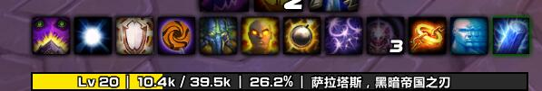

## 萌UI小功能插件集 (MMUI-TinyTools)

萌UI小功能插件集是萌UI界面的可选插件，也可以脱离萌UI单独使用。该插件集为玩家提供方便的小功能，包括常用货币监视、快速焦点目标、打断通报等。每个小功能都由单Lua文件提供，占用率极低，且便于修改和扩展。

***

### 下载地址

* Release: http://pan.baidu.com/s/1mi6RgMk
* Debug: https://github.com/FrozenSky7124/Project_MSVS/tree/master/Lua/MMUI-TinyTools

### 更新说明

v2016-10-10

1. +神器能量条美化 (bAXP.lua)

   鼠标滑过显示神器等级、当前能量、解锁能量等信息。

   

   鼠标滑出渐隐

   

v2016-10-02

1. +职业大厅资源条默认隐藏，鼠标滑过显示。
2. ^使用游戏全局字体，减少插件体积。

v2016-09-26

1. 经验/声望条美化 (bXP.lua)

   

   * shift + 鼠标左键拖动位置

   * 支持鼠标指向显示移出隐藏

   * (神器能量条美化组件开发中...)

2. 常用货币监视 (CurrencyTips.lua)

   

   * 支持横向显示或纵向显示
   * 支持添加删除监视的货币

3. 快速设置焦点目标 (Focuser.lua)

   * shift + 鼠标左键点击即可快速将指向目标设置为焦点

4. 打断通报 (MyInterrupts.lua)

   * 通报玩家的成功打断

     

5. 法术SpellID & 状态AuraID (SpellID.lua)

   

6. 综合功能 (MMUI-TinyTools.lua)

   * /align 命令 打开调试网格